# 🛍️ Velora — Modern Flutter E-Commerce App

Velora is a modern **Flutter e-commerce application** built to demonstrate a complete shopping experience with **Firebase Authentication, Cloud Firestore, Provider state management, and a dedicated Admin Dashboard**.

The app includes both **customer-facing shopping features** and **admin-side store management**, making it a complete portfolio-level Flutter project.

---

## ✨ Features

### 👤 Customer Features

* 🔐 Firebase Email & Password Authentication
* 🏠 Modern Home Screen
* 🔎 Product Search
* 🗂️ Product Categories
* 🛍️ Product Listing & Filtering
* 📦 Product Details
* ❤️ Favorites / Wishlist
* 🛒 Shopping Cart
* ➕➖ Cart Quantity Management
* 💳 Checkout & Payment Method Selection
* 📍 Delivery Address Management
* 📦 Order Placement
* 🧾 My Orders
* 🚚 Order Tracking
* ⭐ Product Reviews & Ratings
* 👤 User Profile
* 🔄 Order Status Updates
* ⚡ Loading, Error & Empty States

### 👨‍💼 Admin Features

* 📊 Admin Dashboard
* 📦 Order Management
* 🔄 Update Order Status
* 🛍️ Product Management
* ➕ Add Products
* ✏️ Edit Products
* 🗑️ Delete Products
* 📈 Sales / Product Overview
* 👥 Admin-only access control

---

## 🔥 Firebase Integration

Velora uses Firebase as its backend infrastructure.

### Firebase Services

* **Firebase Authentication**

  * User registration
  * Login
  * User authentication

* **Cloud Firestore**

  * Products
  * Users
  * Orders
  * Favorites
  * Reviews
  * Admin data

* **Firestore Security Rules**

  * Authenticated user access
  * User-specific data protection
  * Admin-only product management
  * Protected order status updates
  * Review ownership protection

---

## 🛠️ Tech Stack

| Technology              | Purpose                          |
| ----------------------- | -------------------------------- |
| Flutter                 | Cross-platform UI development    |
| Dart                    | Application programming language |
| Provider                | State management                 |
| Firebase Authentication | User authentication              |
| Cloud Firestore         | Backend database                 |
| Material 3              | UI design system                 |
| Google Fonts            | Typography                       |

---

## 📱 Screenshots

### 🚀 Authentication & Home

| Splash Screen | Login |
|---|---|
| 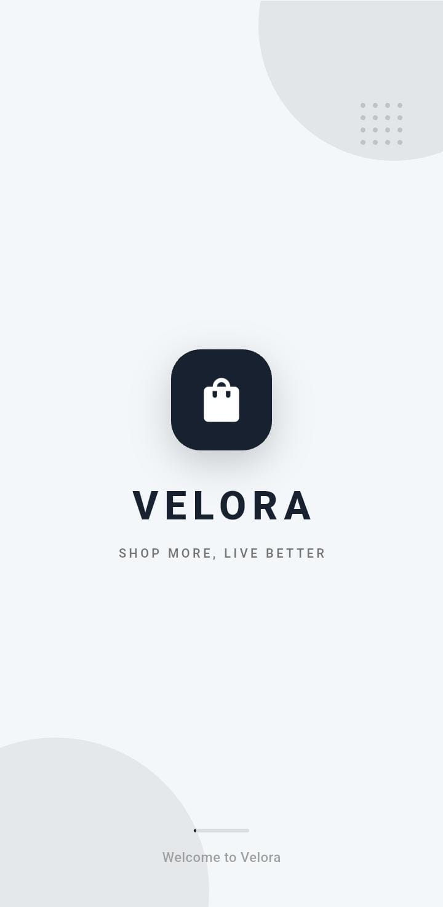 | 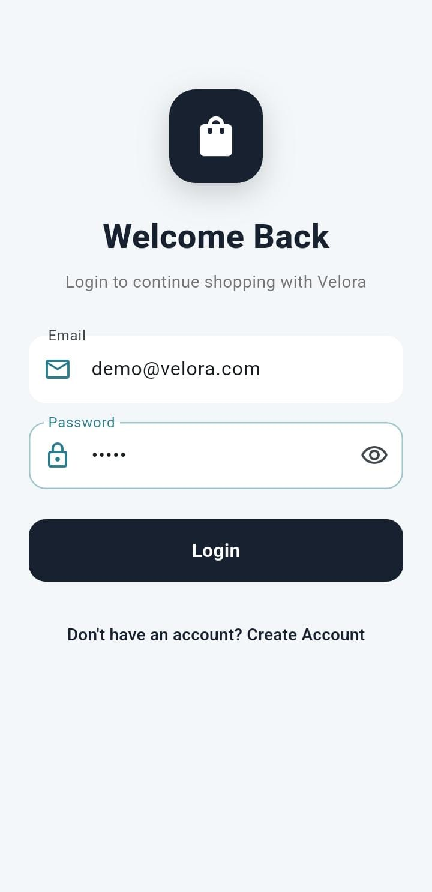 |

| Signup | Home |
|---|---|
| 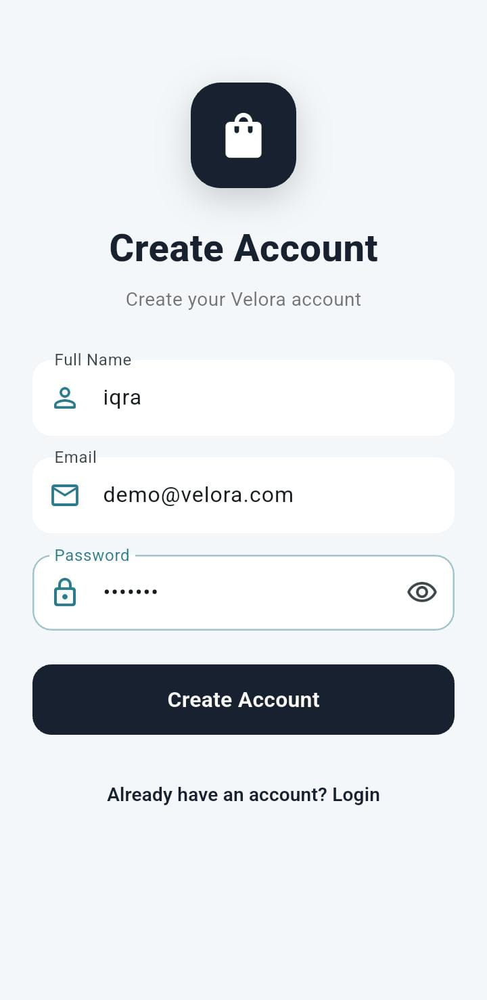 | 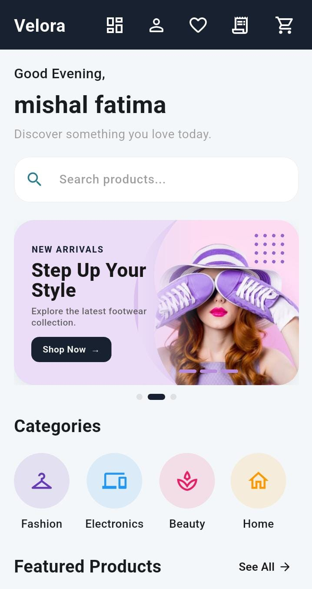 |

### 🛍️ Shopping Experience

| Product Details | Cart / Checkout |
|---|---|
| 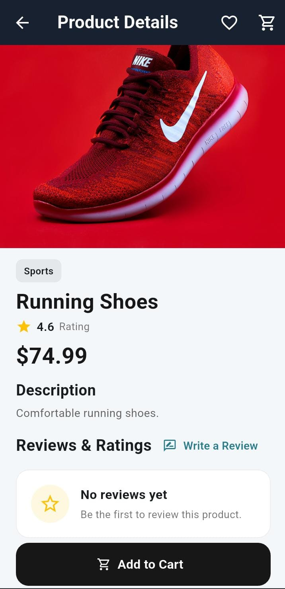 | 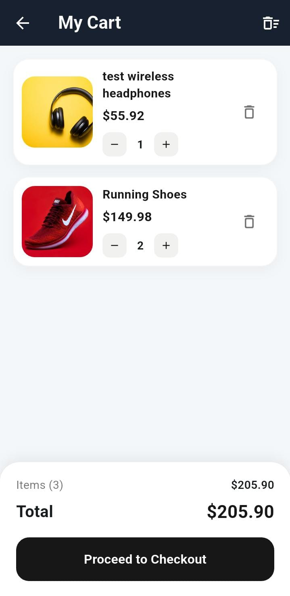 |

| Place Order | Order Confirmation |
|---|---|
| 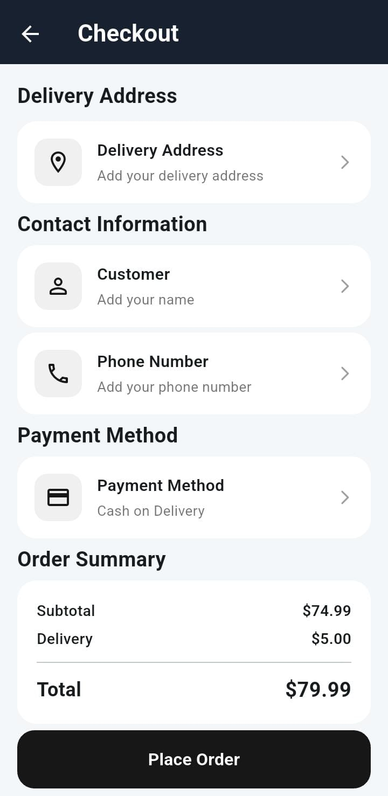 | 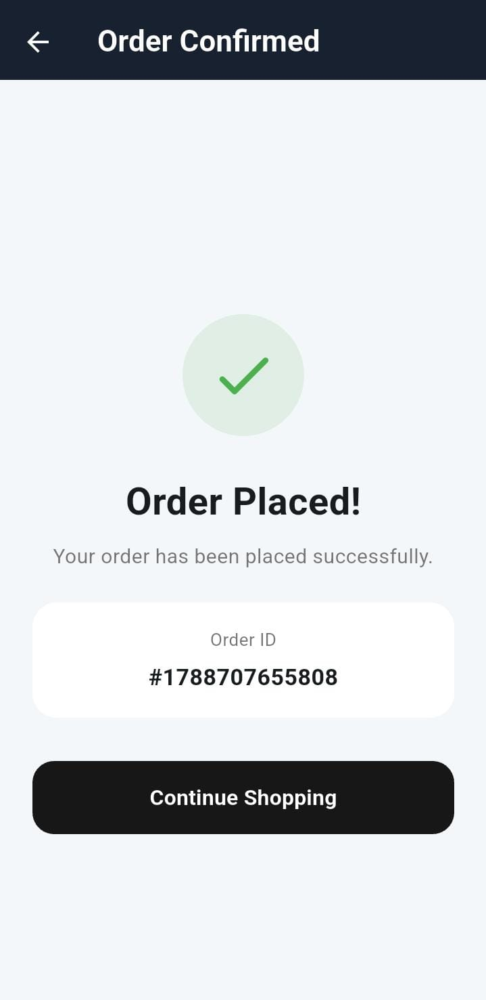 |

| My Orders | Order Tracking |
|---|---|
| 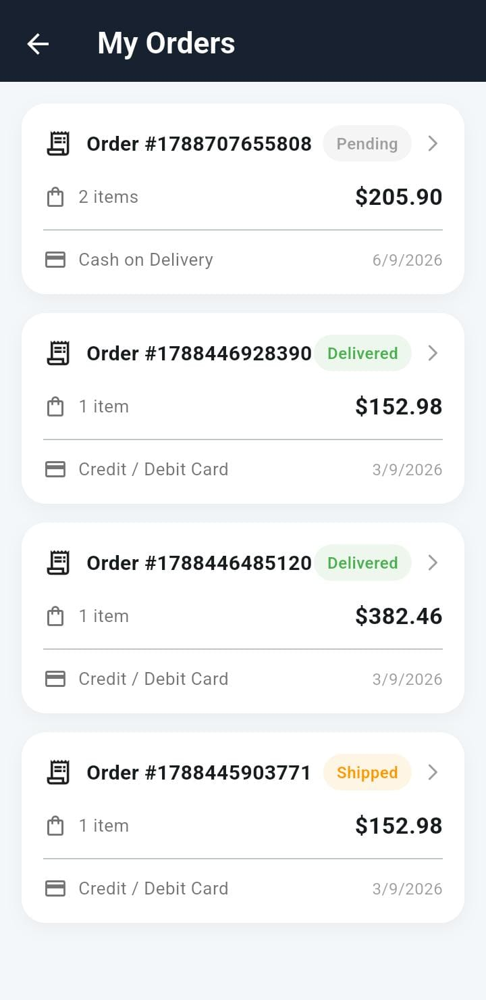 | 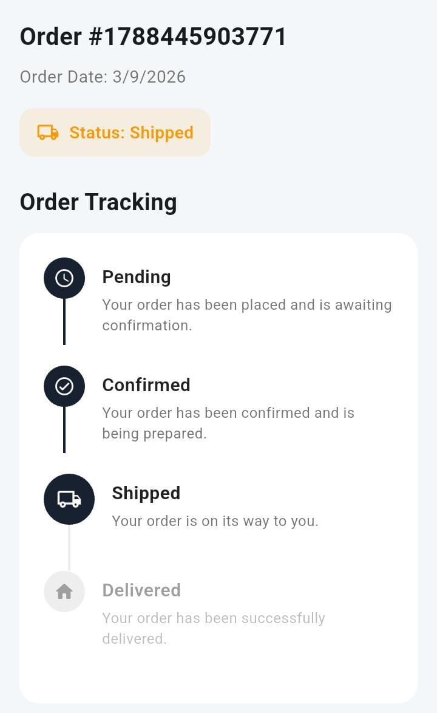 |

| Favorites | Profile |
|---|---|
| 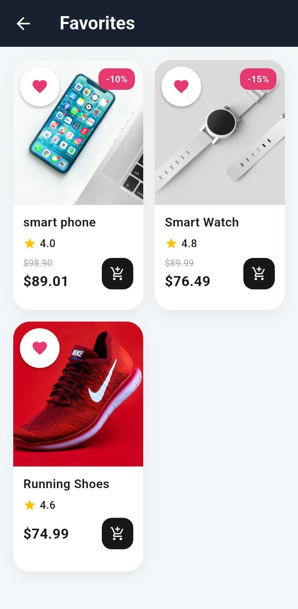 | 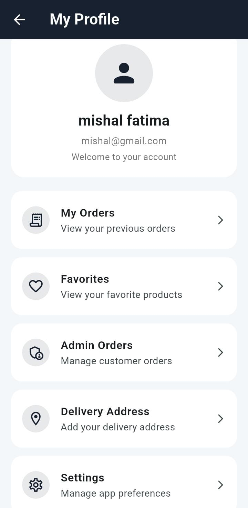 |

### 👨‍💼 Admin Dashboard

| Admin Dashboard | Manage Products |
|---|---|
| 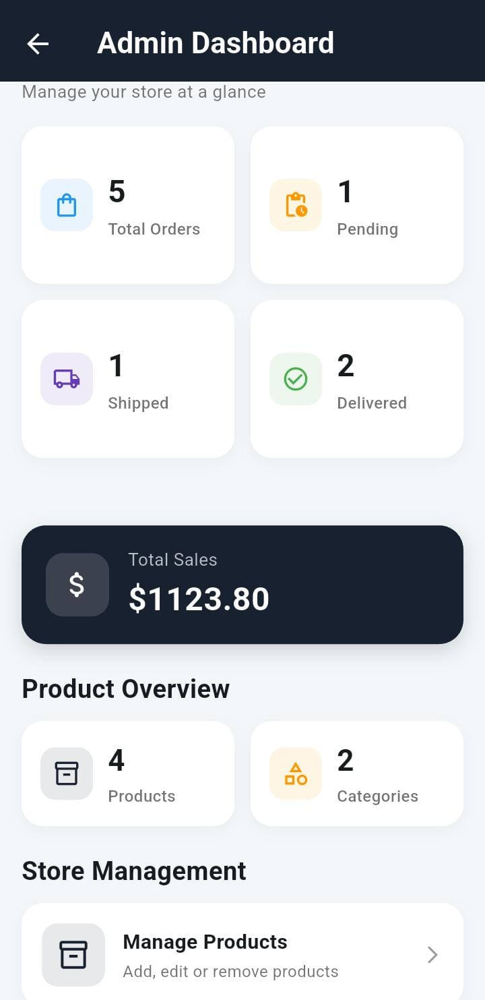 | 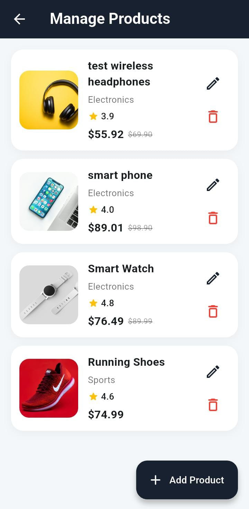 |

| Add Product | Admin Orders |
|---|---|
| 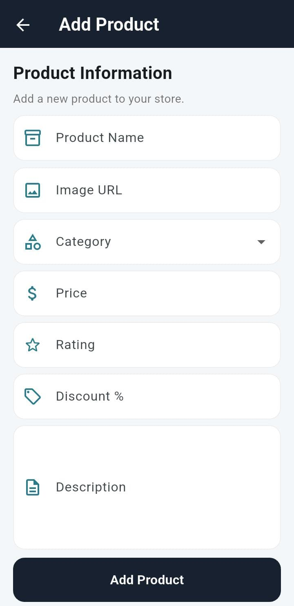 | 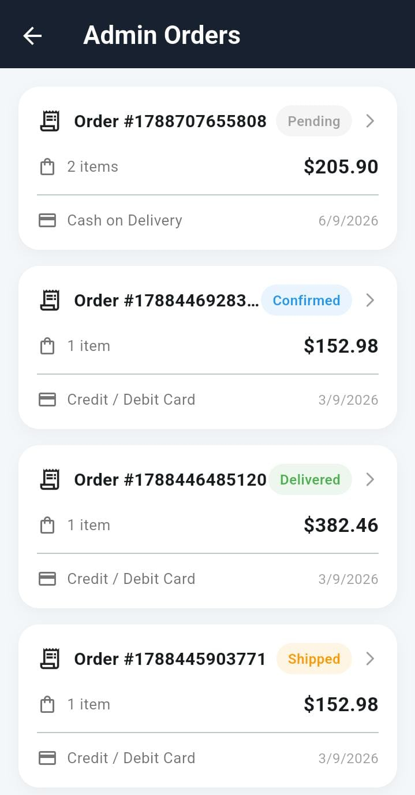 |

| Admin Order Detail |
|---|
| 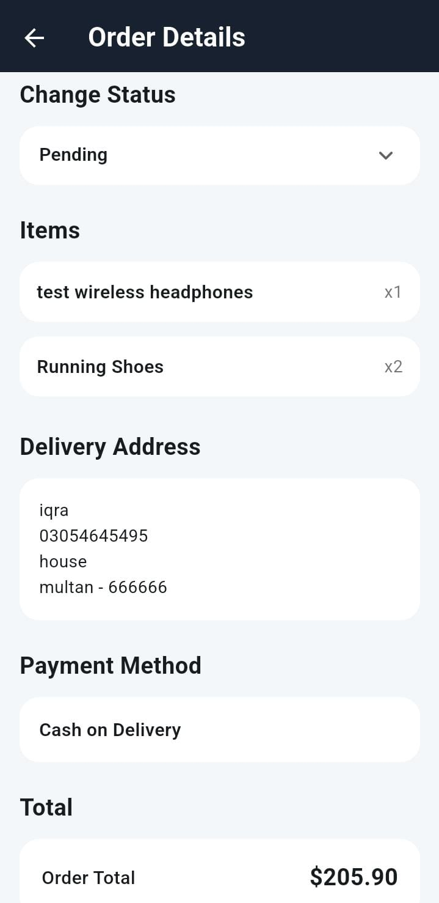 |

## 🏗️ Project Structure

```text
lib/
├── data/
│   ├── categories.dart
│   └── products.dart
│
├── models/
│   ├── product.dart
│   ├── order.dart
│   ├── cart_item.dart
│   └── review.dart
│
├── providers/
│   ├── cart_provider.dart
│   ├── order_provider.dart
│   ├── favorites_provider.dart
│   └── address_provider.dart
│
├── screens/
│   ├── home_screen.dart
│   ├── products_screen.dart
│   ├── product_details_screen.dart
│   ├── cart_screen.dart
│   ├── checkout_screen.dart
│   ├── orders_screen.dart
│   ├── order_tracking_screen.dart
│   ├── favorites_screen.dart
│   ├── profile_screen.dart
│   ├── admin_dashboard_screen.dart
│   ├── admin_orders_screen.dart
│   └── ...
│
├── services/
│   └── firestore_service.dart
│
├── theme/
│   └── app_theme.dart
│
├── widgets/
│   ├── product_card.dart
│   ├── category_item.dart
│   ├── search_bar.dart
│   ├── greeting_header.dart
│   └── ...
│
├── firebase_options.dart
└── main.dart
```

---

## 🚀 Getting Started

### 1. Clone the repository

```bash
git clone https://github.com/iqrarashid19/velora-ecommerce-app.git
```

### 2. Navigate to the project

```bash
cd velora-ecommerce-app
```

### 3. Install dependencies

```bash
flutter pub get
```

### 4. Configure Firebase

Connect the project with your own Firebase project and generate the required Firebase configuration using FlutterFire CLI.

```bash
flutterfire configure
```

### 5. Run the application

```bash
flutter run
```

---

## 🔐 Security

Firebase configuration and sensitive project files should **not** be committed to the repository.

The project uses Firestore Security Rules to restrict access to protected data and admin functionality.

For production deployment, Firebase credentials, API configuration, and security rules should be reviewed according to the deployment environment.

---

## 🎯 What This Project Demonstrates

Velora demonstrates practical Flutter development skills including:

* Clean Flutter project organization
* Reusable widgets
* Provider-based state management
* Firebase Authentication
* Cloud Firestore integration
* CRUD operations
* Role-based admin functionality
* Shopping cart implementation
* Order management
* Reviews & ratings
* Form validation
* Loading and error handling
* Protected Firestore data
* Responsive Material 3 UI

---

## 📌 Future Improvements

Possible future improvements include:

* 💳 Online payment gateway integration
* 🔔 Push notifications
* 📊 Advanced analytics
* 🖼️ Cloud image management
* 📱 App deployment to Play Store
* 🎨 Further UI/UX enhancements

---

## 👨‍💻 Developer

**Iqra Rashid**

Flutter & Dart Developer

Built as a portfolio project to demonstrate modern mobile application development with Flutter and Firebase.

---

## ⭐ Support

If you find this project useful or interesting, consider giving the repository a ⭐ on GitHub.
